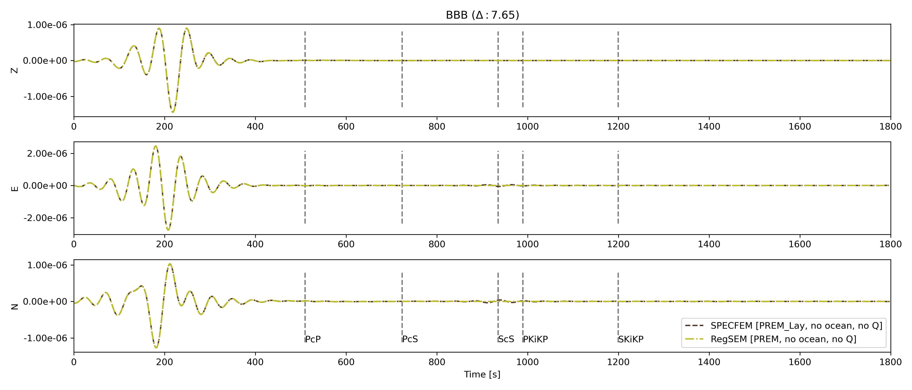
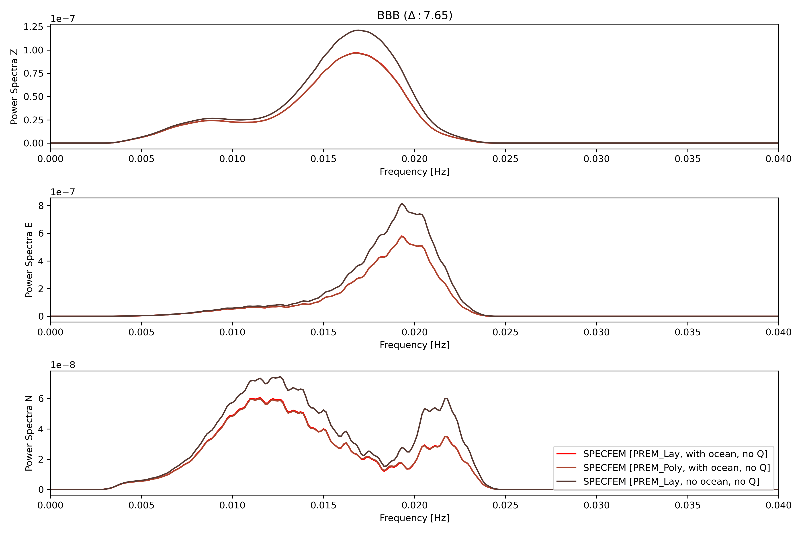

## Compare synthetics for earth models
- Define the input models and the synthetics paths

<figure class="center">

<figcaption><b>BBB Time</b></figcaption>
</figure>

<figure>

<figcaption><b>BBB Frequency</b></figcaption>
</figure>