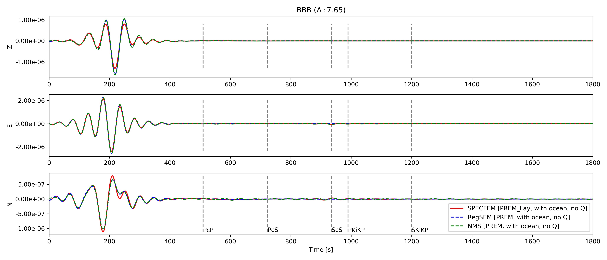
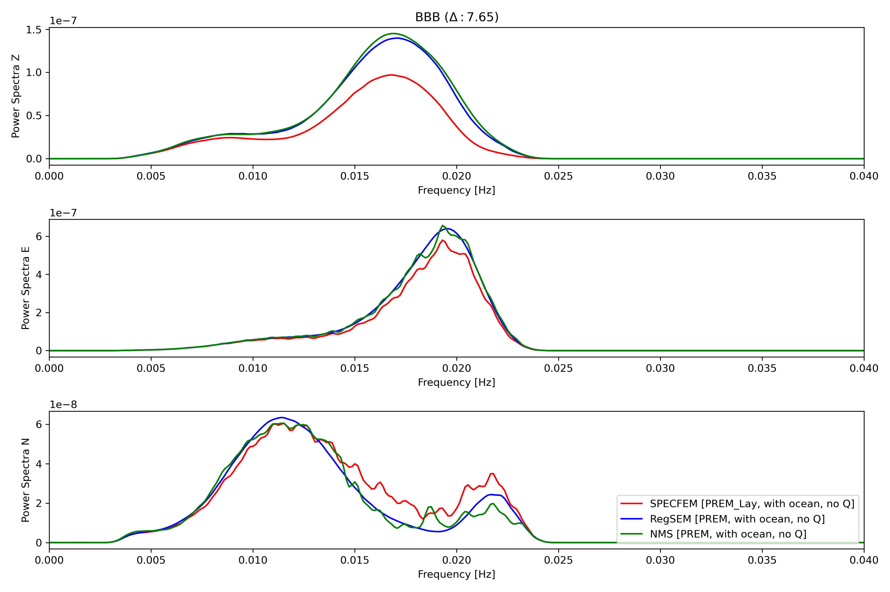

## How to run?
1. Edit the [input_params.yml](input_params.yml)
1. Run the script [`check_traces_single_station.py`](check_traces_single_station.py)
    ```
    python check_traces_single_station.py
    ```

## Dependencies
1. Numpy
1. Matplotlib
1. Obspy
1. Pyyaml
1. Pandas

## Tested Cases
- Compared the Specfem Layered with Polynomial: matches fairly well
- Compared the Specfem Layered with ocean vs Specfem layered without ocean
- Compared RegSEM with Normal-mode synthetics 
- Compared RegSEM with SPECFEM for no ocean, no topography: matches very well
- Compared the SPECFEM runs for R_EARTH = 6371 and 6368 km
- Compared SPECFEM with/without elevated receivers
- Compared SPECFEM with SPECFEM version with etopo values 0

## Input parameters
Model: **Preliminary Earth Reference Model**, with the ocean layer of thickness 3 km
* Spherical Earth: ON
* Anisotropy: ON
* **Oceans: ON**
* Topography: ON
* Gravity: OFF
* Attenuation: OFF
* Ellipticity: OFF

## Input Event and Stations Locations
<hr>
<p align="center">

</p>
<p align="center"><b>Event-Stations Map</b></p>
<hr>

## Results
- Comparison between SPECFEM, RegSEM and NMS (Normal-mode synthetics) with OCEAN, anisotropy and Topography. No mirror for the cases of SPECFEM and RegSEM.

<hr>
<p align="center">

</p>
<p align="center"><b>BBB Time</b></p>
<hr>

<p align="center">

</p>
<p align="center"><b>BBB Frequency</b></p>
<hr>